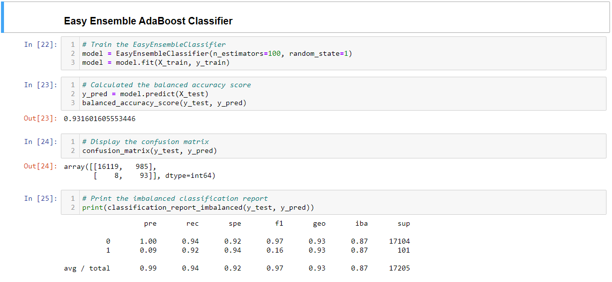

# Credit_Risk_Analysis
The goal of this analysis is to analyze the efficacy of various machine learning algorithms when used to predict risk category (high-risk, 1; or low-risk, 0) of a population of credit data for loan applicants

## Project Overview
Using Scikit, train and test various oversampling, undersampling, and ensemble learning methods on a given population of credit data.

## Results - Sampling

The six analyses can be most easily divded into two categories: sampling modification and testing modification. The four sampling modifications all used logistic regression to train the model, but used different sampling techniques to account for the significant difference in magnitude of low- and high-risk applicants

1. The Naive Random Oversampling technique performed reasonably well across the board, with an accuracy score of about 84%, and similar values for precision and recall.

2. Smote oversampling performed even better than NRO across the board, with scores around 87%

3. Random undersampling produced scores similar to NRO, though precision and recall varied more between the target column states.

4. Smoteenn performed noticeably poorer on all metrics than the other three sampling techniques. Given the greater resource usage of this technique than the others above, it seems like a decidedly poor option for this application.

## Results - Testing

The testing modification strategies didn't resample data, and, instead used different testing methods to  determine whether an applicant was low- or high-risk. 

1. The Balanced Random Forest technique exceeded SMOTEENN analysis, but didn't come close to the accuracy of the other sampling techniques. Additionally, its precision for high-risk applicants was abyssmal, catching only 3%.

	* 

	One interesting benefit of the BRF testing is that it gives us the opportunity to see which 	features had the greatest impact on the assessment. Unsurprisingly, with dozens of features, no 	one single feature accounted for more than 9% of the total decision, and dozens accounted for 		less than 1%. Additionally, roughly 1/4 of the decision came down to how much of the loan had 	already been paid down (in absolute terms).

2. The Easy Ensemble produced the highest accuracy score, but as you would expect in a population with such a disparity of outcome populations, there simply weren't enough high-risk applicants without resampling to get a good sense, and precision of high-risk applicants was only 9%.

## Summary

Given the significant disparity between the number of low-risk and high-risk applicants, there simply is no way to get an accurate read on this data set without doing some sampling modification. Of the techniques examined, SMOTE sampling gave the best results, and, thus, seems to be the best option in this isntance.